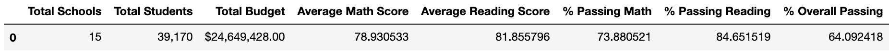
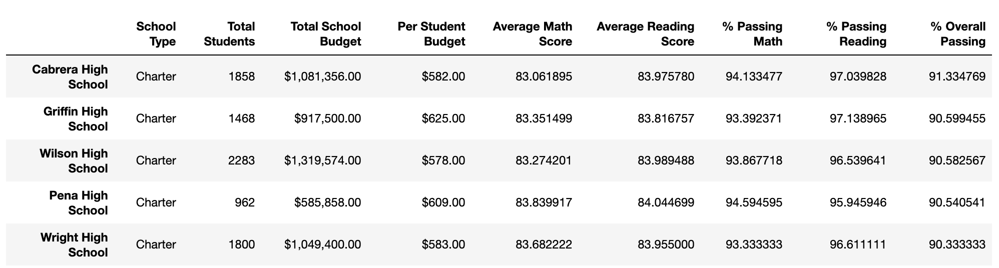
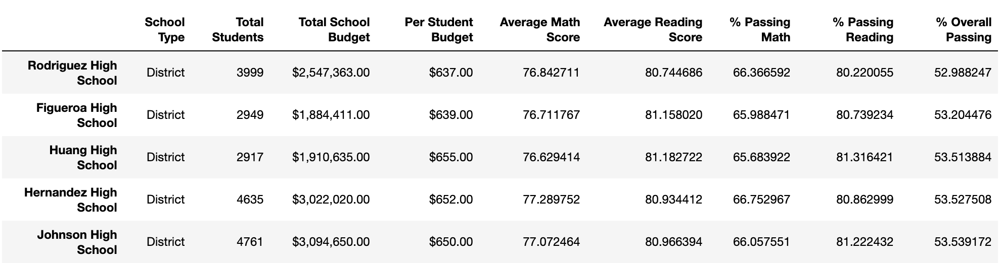
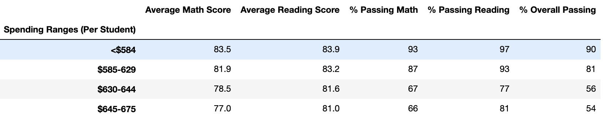
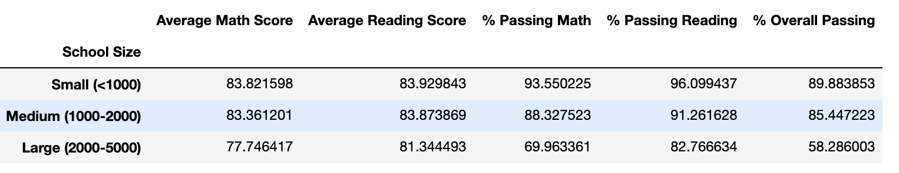
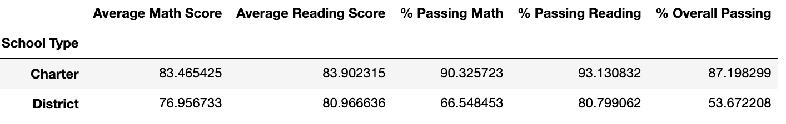

# School_District_Analysis Challenge

# Overview
The school district discovered that the standardized test scores for ninth grade students at Thomas High School were incorrect, and they requested for updated data summaries. After further discussion, it was best to only replace the ninth grade math and reading scores at Thomas High School while keeping all other data associated with this student group together.

# Results

* ### How is the district summary affected?

When assessing average scores and passing percentages among the 15 high schools in the school district, the average math score dropped whilst the average reading score stayed the same, the percentage passing math dropped by 1%, the percentage passing reading dropped 1%, and the overall passing percent dropped 1%.

* ### How is the school summary affected?

### How does replacing the ninth graders’ math and reading scores affect Thomas High School’s performance relative to the other schools?

Replacing the math and reading scores for Thomas High School with NaNs while keeping the rest of the data intact showed that the other schools had a great passing rate. 

### How does replacing the ninth-grade scores affect the following:

* ### Math and reading scores by grade

This data replacement did not change the math and reading scores by grade. Granted, both the average math and reading score summaries were stratisfied by school and grade level. The summary tables display "NaN" for ninth grade at Thomas High School whereas the remaining data remained intact.

* ### Scores by school spending

When reviewing the School Spending summary, this data change did not impact the spending ranges for either the average math scores or average reading scores. However, this data change did impact the spending ranges for passing percentages. According to the summary above, there was a 6% decrease in % passing math, a 7% decrease in % passing reading, and a 6% decrease in % overall passing in the $630-644 spending range.

* ### Scores by school size

Removing the ninth grade scores did not affect the average math and reading scores, but it did affect the passing percentages for medium-sized schools (1,000-2,000). In this category, % passing math, % passing reading, and % overall passing dropped 6% each. Before the data change, the School Size summary showed that medium-sized school had a high performance (91% overall passing) compared to small (90% overall passing) and large schools (58% overall passing). Given the data change, medium size school are the second in performance (85% overall passing).

* ### Scores by school type

For the last summary on School Types, this data change also affected the passing percentages that compared charter and district schools. Fortunately, it did not affect the average scores for these two school types. Removing the scores resulted in a reduction in charter school's passing percentages. Before the data change, charter schools had very high passing percentages: 94% passing math, 97% passing reading, 90% overall passing. After the data change, charter schools now have a 90% passing math, 93% passing reading, 87% overall passing. On the plus side, these rates are still far superior when compared to district schools.

# Summary

Overall, the data change did not impact the spending ranges for either the average math scores or average reading scores. Given the data change, medium size schools are the second in performance (85% overall passing). After the data change, charter schools now have a 90% passing math, 93% passing reading, 87% overall passing. Rodriguez High School was the worst performing school whilst and Cabrera High School was the top performing school (despite having a lower budget).
